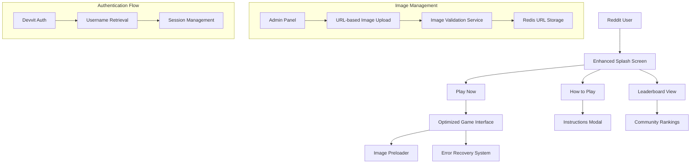
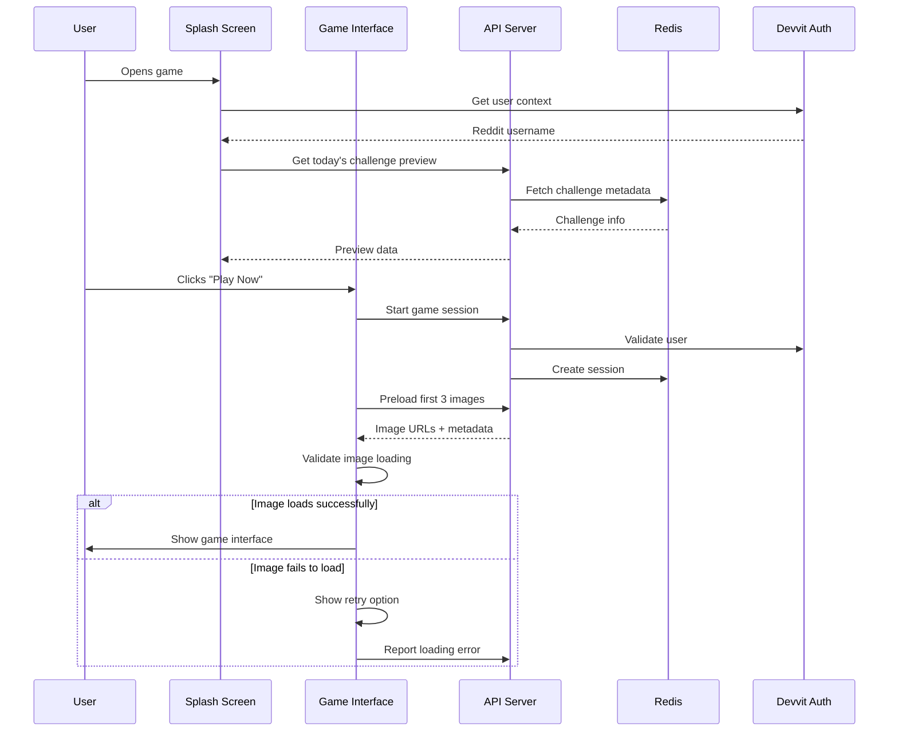

# Design Document

## Overview

This design addresses critical improvements to the PicOrPixel game, focusing on creating an engaging splash screen experience, resolving image loading issues, implementing URL-based admin image management, ensuring proper Reddit username integration, and delivering a functional leaderboard system. The solution maintains the existing React-Devvit architecture while significantly improving user experience and administrative capabilities.

## Architecture

### Enhanced Client Architecture



### Improved Data Flow



## Components and Interfaces

### 1. Enhanced Splash Screen Component

**Purpose**: Clean, engaging entry point with three clear action buttons

**Design Specifications**:
- **Layout**: Centered card design with minimal text
- **Buttons**: Three prominent buttons in a vertical or horizontal layout
- **Visual Elements**: Game logo, today's challenge preview, player count
- **Mobile Optimization**: Touch-friendly button sizes (minimum 44px height)

```typescript
interface SplashScreenProps {
  todaysChallenge: ChallengeSummary;
  userStats: UserQuickStats;
  onPlayNow: () => void;
  onHowToPlay: () => void;
  onLeaderboard: () => void;
}

interface ChallengeSummary {
  date: string;
  imageCount: number;
  playersToday: number;
  estimatedTime: string;
  theme?: string;
  userCompleted: boolean;
  userScore?: number;
}
```

### 2. Optimized Image Loading System

**Purpose**: Eliminate persistent loading states and provide smooth image experience

**Key Features**:
- **Preloading Strategy**: Load first 3 images immediately, queue remaining images
- **Loading States**: Maximum 5-second loading timeout per image
- **Error Recovery**: Retry mechanism with exponential backoff
- **Skip Functionality**: Allow users to skip problematic images

```typescript
interface ImageLoaderProps {
  imageUrl: string;
  onLoad: (success: boolean) => void;
  onError: (error: ImageLoadError) => void;
  timeout?: number; // Default 5000ms
}

interface ImageLoadError {
  type: 'timeout' | 'network' | 'invalid_url' | 'server_error';
  message: string;
  retryable: boolean;
}

class ImagePreloader {
  preloadImages(urls: string[], onProgress: (loaded: number, total: number) => void): Promise<ImageLoadResult[]>;
  validateImageUrl(url: string): Promise<boolean>;
  getImageDimensions(url: string): Promise<{width: number, height: number}>;
}
```

### 3. Admin Image Management System

**Purpose**: URL-based image management without file storage

**Admin Panel Features**:
- **URL Input**: Paste image URLs from external hosts (ImageBB, Imgur, etc.)
- **Image Preview**: Immediate preview of submitted URLs
- **Classification**: Mark as AI-generated or real photo
- **Batch Operations**: Add multiple images at once
- **Image Validation**: Check URL accessibility and image format

```typescript
interface AdminImageUpload {
  url: string;
  isAIGenerated: boolean;
  difficulty: 'easy' | 'medium' | 'hard';
  source: string; // e.g., "ImageBB", "Imgur"
  tags?: string[];
  description?: string;
}

interface ImageValidationResult {
  valid: boolean;
  accessible: boolean;
  format: string; // 'jpg', 'png', 'webp'
  dimensions: {width: number, height: number};
  fileSize?: number;
  errors?: string[];
}
```

### 4. Reddit Username Integration

**Purpose**: Seamless username retrieval and display throughout the game

**Implementation Strategy**:
- **Authentication Hook**: Use Devvit's built-in authentication
- **Session Persistence**: Store username in game session
- **Fallback Handling**: Graceful degradation for auth failures
- **Privacy Controls**: Respect user privacy preferences

```typescript
interface UserAuthService {
  getCurrentUser(): Promise<RedditUser | null>;
  getUserContext(): Promise<UserContext>;
  validateSession(): Promise<boolean>;
}

interface RedditUser {
  username: string;
  id: string;
  isAuthenticated: boolean;
}

interface UserContext {
  user: RedditUser;
  subreddit: string;
  postId?: string;
}
```

### 5. Functional Leaderboard System

**Purpose**: Display community rankings with proper user identification

**Leaderboard Features**:
- **Daily Rankings**: Top 10 players for current day
- **User Highlighting**: Highlight current user's position
- **Historical Data**: Show user's best previous scores
- **Participation Stats**: Total players and completion rates

```typescript
interface LeaderboardEntry {
  rank: number;
  username: string;
  score: number;
  completionTime: number;
  isCurrentUser: boolean;
}

interface LeaderboardData {
  dailyTop10: LeaderboardEntry[];
  userRank?: number;
  userBestScore?: number;
  totalPlayersToday: number;
  lastUpdated: Date;
}
```

## Data Models

### Enhanced Redis Schema

#### Image Management
```typescript
// Key: image:{imageId}
interface StoredImage {
  id: string;
  url: string; // External URL (ImageBB, etc.)
  isAIGenerated: boolean;
  difficulty: 'easy' | 'medium' | 'hard';
  source: string;
  addedBy: string; // Admin username
  addedAt: Date;
  tags: string[];
  validationStatus: 'pending' | 'valid' | 'invalid';
  lastValidated: Date;
}
```

#### User Sessions with Username
```typescript
// Key: session:{userId}:{challengeId}
interface GameSession {
  id: string;
  userId: string;
  username: string; // Reddit username
  challengeId: string;
  startTime: Date;
  guesses: ImageGuess[];
  completed: boolean;
  score?: number;
  completionTime?: number;
}
```

#### Enhanced Leaderboard
```typescript
// Key: leaderboard:daily:{date}
// Sorted Set: score -> userId:username
interface LeaderboardEntry {
  userId: string;
  username: string;
  score: number;
  completionTime: number;
  timestamp: Date;
}
```

## Error Handling

### Image Loading Error Recovery

1. **Timeout Handling**
   - 5-second maximum loading time per image
   - Automatic retry with exponential backoff (1s, 2s, 4s)
   - Skip option after 3 failed attempts

2. **Network Error Recovery**
   - Detect offline state
   - Queue failed requests for retry when online
   - Provide clear user feedback

3. **Invalid URL Handling**
   - Pre-validate URLs before adding to game rotation
   - Remove broken images from active challenges
   - Log errors for admin review

### Authentication Error Handling

1. **Username Retrieval Failures**
   - Fallback to "Anonymous Player" display
   - Log authentication errors for debugging
   - Retry authentication on user action

2. **Session Management**
   - Graceful handling of expired sessions
   - Automatic session refresh when possible
   - Clear error messages for auth failures

## Testing Strategy

### Image Loading Testing

1. **Load Testing**
   - Test with various image hosting services
   - Simulate slow network conditions
   - Test timeout and retry mechanisms

2. **Error Simulation**
   - Mock failed image requests
   - Test invalid URL handling
   - Verify skip functionality

### Authentication Testing

1. **Reddit Integration**
   - Test username retrieval in Devvit playtest environment
   - Verify session persistence across page refreshes
   - Test authentication error scenarios

2. **Leaderboard Testing**
   - Verify username display in rankings
   - Test user highlighting functionality
   - Validate ranking calculations

### Admin Panel Testing

1. **URL Validation**
   - Test various image hosting services
   - Verify image format validation
   - Test batch upload functionality

2. **Image Management**
   - Test image classification workflow
   - Verify Redis storage operations
   - Test image removal and cleanup

## Performance Optimizations

### Image Loading Performance

1. **Preloading Strategy**
   - Load first 3 images immediately on game start
   - Progressive loading for remaining images
   - Intelligent caching based on user behavior

2. **Image Optimization**
   - Recommend optimal image formats (WebP, AVIF)
   - Suggest image compression guidelines for admins
   - Implement responsive image loading based on device

### Redis Performance

1. **Efficient Data Structures**
   - Use Redis Sorted Sets for leaderboards
   - Implement proper TTL for temporary data
   - Optimize key naming for better performance

2. **Connection Management**
   - Connection pooling for high traffic
   - Graceful degradation during Redis outages
   - Monitoring and alerting for performance issues

## Mobile Optimization

### Touch-Friendly Interface

1. **Button Sizing**
   - Minimum 44px touch targets
   - Adequate spacing between interactive elements
   - Clear visual feedback for touch interactions

2. **Image Display**
   - Optimized image sizes for mobile screens
   - Touch gestures for image zoom/pan
   - Efficient loading for mobile networks

### Performance Considerations

1. **Bundle Size**
   - Code splitting for admin panel
   - Lazy loading of non-critical components
   - Optimized asset delivery

2. **Network Efficiency**
   - Minimize API calls
   - Efficient caching strategies
   - Progressive enhancement for slow connections
