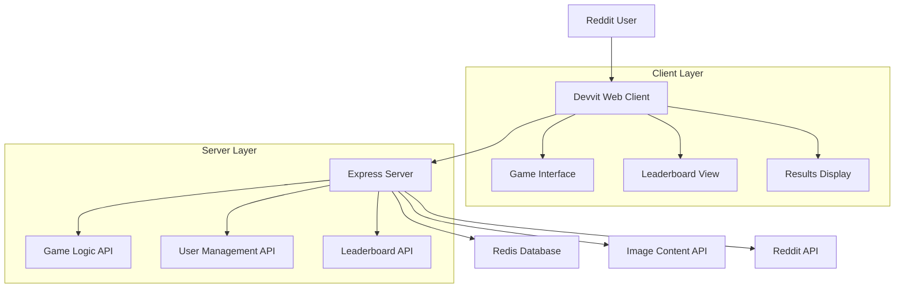

# Design Document

## Overview

PicOrPixel is a React-based Devvit web application that presents users with daily image identification challenges. The game leverages Devvit's client-server architecture with Redis for data persistence, providing a seamless Reddit-integrated gaming experience where users distinguish AI-generated images from real photographs.

## Architecture

### High-Level Architecture



### Technology Stack

- **Frontend**: React.js with TypeScript for type safety
- **Backend**: Express.js server with TypeScript
- **Database**: Redis for data persistence and caching
- **Platform**: Devvit Web framework
- **Build System**: Vite for both client and server builds

## Components and Interfaces

### Client Components

#### 1. SplashScreen Component
- **Purpose**: Engaging entry point displayed in Reddit feed
- **Features**: 
  - Eye-catching visual design with game branding
  - "Play" button to launch full-screen game
  - Daily challenge preview information
- **Props**: `dailyChallenge: DailyChallenge`

#### 2. GameInterface Component
- **Purpose**: Main game interaction interface
- **Features**:
  - Image display with zoom/pan capabilities
  - "AI Generated" and "Real Photo" selection buttons
  - Progress indicator showing current image number
  - Score tracking display
- **Props**: `images: GameImage[], onSelection: (imageId: string, guess: boolean) => void`

#### 3. ResultsDisplay Component
- **Purpose**: Shows game completion results and community comparison
- **Features**:
  - Final score percentage
  - Correct/incorrect breakdown
  - Community ranking position
  - Share to Reddit functionality
- **Props**: `gameResult: GameResult, leaderboard: LeaderboardEntry[]`

#### 4. LeaderboardView Component
- **Purpose**: Community leaderboard and personal statistics
- **Features**:
  - Daily top performers list
  - Personal best scores history
  - Achievement badges display
  - Streak tracking
- **Props**: `leaderboard: LeaderboardEntry[], userStats: UserStats`

### Server API Endpoints

#### 1. `/api/daily-challenge`
- **Method**: GET
- **Purpose**: Retrieve current day's image set
- **Response**: `DailyChallenge` object with images and metadata
- **Caching**: Redis cache with daily expiration

#### 2. `/api/submit-guess`
- **Method**: POST
- **Purpose**: Submit user's guess for an image
- **Body**: `{ imageId: string, guess: boolean }`
- **Response**: `{ correct: boolean, explanation?: string }`

#### 3. `/api/complete-game`
- **Method**: POST
- **Purpose**: Finalize game session and calculate score
- **Body**: `{ sessionId: string }`
- **Response**: `GameResult` with score and ranking

#### 4. `/api/leaderboard`
- **Method**: GET
- **Purpose**: Retrieve community leaderboard
- **Query**: `?period=daily|weekly|alltime`
- **Response**: `LeaderboardEntry[]` array

#### 5. `/api/user-stats`
- **Method**: GET
- **Purpose**: Get user's historical performance
- **Response**: `UserStats` with trends and achievements

## Data Models

### Core Data Types

```typescript
interface DailyChallenge {
  id: string;
  date: string;
  images: GameImage[];
  totalImages: number;
}

interface GameImage {
  id: string;
  url: string;
  isAIGenerated: boolean;
  difficulty: 'easy' | 'medium' | 'hard';
  source?: string;
  explanation?: string;
}

interface GameSession {
  id: string;
  userId: string;
  challengeId: string;
  startTime: Date;
  guesses: ImageGuess[];
  completed: boolean;
  score?: number;
}

interface ImageGuess {
  imageId: string;
  guess: boolean;
  correct: boolean;
  timestamp: Date;
}

interface GameResult {
  sessionId: string;
  score: number;
  correctCount: number;
  totalCount: number;
  rank: number;
  totalPlayers: number;
  achievements?: Achievement[];
}

interface LeaderboardEntry {
  userId: string;
  username: string;
  score: number;
  rank: number;
  gamesPlayed: number;
  averageScore: number;
}

interface UserStats {
  userId: string;
  totalGamesPlayed: number;
  averageScore: number;
  bestScore: number;
  currentStreak: number;
  longestStreak: number;
  achievements: Achievement[];
  scoreHistory: ScoreEntry[];
}

interface Achievement {
  id: string;
  name: string;
  description: string;
  unlockedAt: Date;
  icon: string;
}
```

### Redis Data Structure

#### Daily Challenges
- **Key Pattern**: `challenge:YYYY-MM-DD`
- **Type**: Hash
- **Fields**: `id`, `images`, `totalImages`, `createdAt`
- **TTL**: 48 hours (allows overlap for timezone differences)

#### User Sessions
- **Key Pattern**: `session:{userId}:{challengeId}`
- **Type**: Hash
- **Fields**: `startTime`, `guesses`, `completed`, `score`
- **TTL**: 7 days

#### Leaderboards
- **Key Pattern**: `leaderboard:daily:YYYY-MM-DD`
- **Type**: Sorted Set
- **Score**: User's game score
- **Member**: User ID
- **TTL**: 30 days

#### User Statistics
- **Key Pattern**: `user:stats:{userId}`
- **Type**: Hash
- **Fields**: `totalGames`, `averageScore`, `bestScore`, `currentStreak`, `achievements`
- **TTL**: No expiration (persistent user data)

## Error Handling

### Client-Side Error Handling

1. **Network Failures**
   - Retry mechanism for API calls with exponential backoff
   - Offline state detection and user notification
   - Graceful degradation when server is unavailable

2. **Image Loading Errors**
   - Fallback placeholder images
   - Skip functionality for broken images
   - Error reporting to server for content management

3. **Session Management**
   - Automatic session recovery on page refresh
   - Progress preservation in localStorage
   - Clear error messages for expired sessions

### Server-Side Error Handling

1. **Redis Connection Issues**
   - Connection retry logic with circuit breaker pattern
   - Fallback to in-memory storage for critical operations
   - Graceful degradation of non-essential features

2. **Content API Failures**
   - Cached fallback content for daily challenges
   - Error logging and monitoring
   - Automatic content validation

3. **Rate Limiting**
   - Request throttling per user
   - Queue management for high traffic periods
   - Clear error responses with retry timing

### Error Response Format

```typescript
interface ErrorResponse {
  error: {
    code: string;
    message: string;
    details?: any;
    retryAfter?: number;
  };
}
```

## Testing Strategy

### Unit Testing

1. **Client Components**
   - React Testing Library for component behavior
   - Jest for utility functions and game logic
   - Mock API responses for isolated testing

2. **Server Endpoints**
   - Supertest for API endpoint testing
   - Redis mock for database operations
   - Authentication middleware testing

3. **Shared Logic**
   - Pure function testing for game calculations
   - Type validation testing
   - Edge case handling verification

### Integration Testing

1. **Client-Server Communication**
   - End-to-end API flow testing
   - Error handling verification
   - Session management testing

2. **Redis Operations**
   - Data persistence verification
   - TTL behavior testing
   - Concurrent access handling

### Performance Testing

1. **Load Testing**
   - Concurrent user simulation
   - Redis performance under load
   - API response time monitoring

2. **Mobile Performance**
   - Image loading optimization testing
   - Touch interaction responsiveness
   - Battery usage optimization

### Devvit Platform Testing

1. **Playtest Environment**
   - Full game flow testing in Reddit context
   - Authentication integration verification
   - Mobile and desktop compatibility testing

2. **Content Policy Compliance**
   - Image content validation
   - User data handling verification
   - Privacy policy compliance testing
